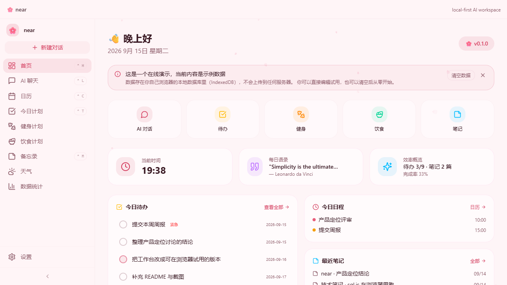
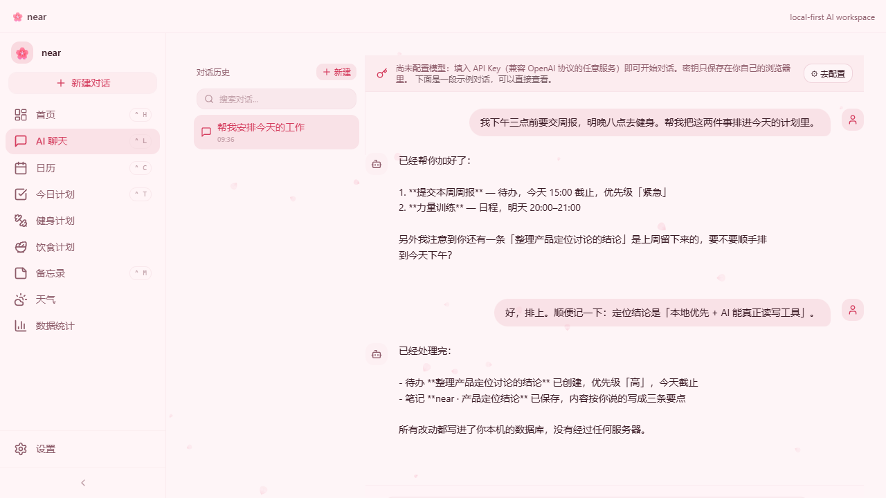
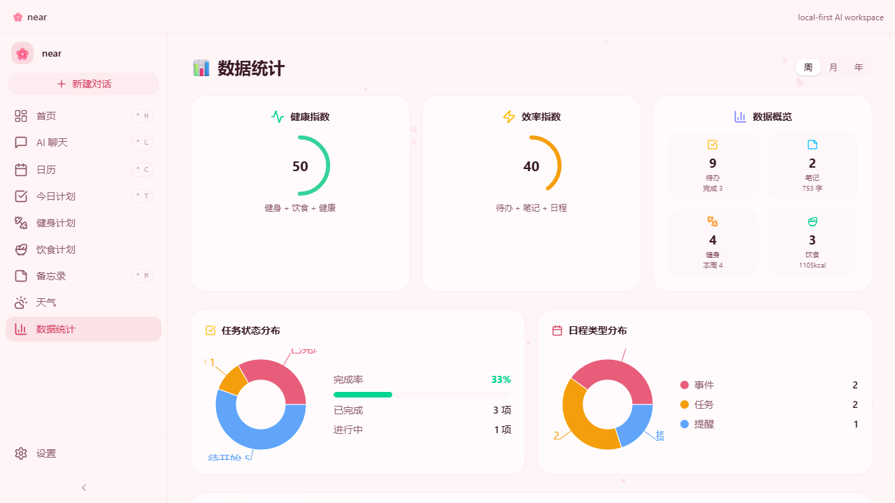

# near

**A local-first AI workspace you actually own — todos, notes and calendar that live on your machine, and an AI that can read and write them.**

### ▶ [Try it in your browser](https://fe1l-tech.github.io/near/) — no install, no account

The live demo runs the real thing: the same schema, the same migrations, SQLite compiled to WebAssembly, persisted into your browser's IndexedDB. It opens with sample data so you can see how the pieces fit; "clear data" empties it if you'd rather start from scratch.

<p align="center">
  
  
</p>
<p align="center">
  
  
</p>

Most "AI productivity" tools keep your data in their cloud and treat the AI as a chat box bolted onto the side. `near` does the opposite:

- **Your data stays local.** Everything lives in a SQLite database on your own disk. No account, no sync, no server of ours.
- **Bring your own key.** Works with any OpenAI-compatible endpoint. You are never locked to one provider.
- **The AI actually does things.** It doesn't just chat — it can create todos, write notes and add calendar events, in the same database your UI reads from.

> **Note on the interface language:** the UI is currently Chinese-only. The screenshots above reflect that. English strings and an i18n layer are planned; the codebase already avoids hardcoding where it can.

---

## Why

Two things are scarce in this space, and neither is "a smarter model":

1. **Continuity of your own data.** Your notes, your unfinished tasks, your habits. Chat-based assistants forget; a local store doesn't.
2. **A privacy boundary that actually holds.** Every major tool is drifting toward the cloud. `near` is local by construction, not by policy.

So the bet here is not the strongest AI. It's *your data, plus a reliable local actor that can operate on it*.

## Features

| Module | Status |
|---|---|
| Todo / daily plan | ✅ with priority, due dates, completion rate |
| Notes | ✅ with tag filtering and version snapshots |
| Calendar | ✅ month / week / day views |
| AI chat | ✅ streaming, reasoning-chain display, conversation history |
| Fitness & body stats | ✅ log-based, with trend charts |
| Diet & water | ✅ daily nutrition summary |
| Dashboard | ✅ aggregates todos, notes, calendar and a daily quote |
| Weather | ✅ Open-Meteo, no API key required |
| Live demo | ✅ [browser build on GitHub Pages](https://fe1l-tech.github.io/near/) |

## Two ways to run it

### 1. Desktop app (full experience)

```bash
npm install
npm run build      # builds renderer + main + preload into out/
npm run dev:electron
```

To produce an installer:

```bash
npm run package    # electron-builder → release/
```

> The desktop build additionally supports running a local **Claude Code CLI** as an alternative AI backend (it shells out to a local process). This is desktop-only by nature.

### 2. In the browser (no install)

```bash
npm run dev        # Vite dev server, renderer only
```

In this mode the app runs entirely client-side: the same SQLite schema is executed by **sql.js compiled to WebAssembly**, and the database is persisted into **IndexedDB**. The code that implements this lives in
`src/renderer/core/db/browser-db.ts` and `src/renderer/core/ipc/web-api.ts`.

Browser mode is why the project's data layer was made host-agnostic: `src/shared/db/` holds the schema and migrations, and both the Electron main process and the browser build run the exact same migrations.

The browser build is published to GitHub Pages by
[`.github/workflows/deploy-web.yml`](.github/workflows/deploy-web.yml). One deployment subtlety is worth knowing: `base: './'` makes bundled assets relative, but sql.js resolves its `.wasm` file **at runtime**, so Vite cannot rewrite that URL. The workflow therefore passes `APP_BASE=/<repo>/`, and `src/renderer/core/build-info.ts` turns it into the wasm URL. Get this wrong and the wasm 404s into an opaque *"expected magic word"* error, because static hosts answer the missing path with `index.html`.

## Architecture

```
src/
  shared/db/          schema + migrations + seed data (used by BOTH runtimes)
  main/               Electron main process: sql.js on the filesystem, IPC handlers
  preload/            contextBridge contract exposed as window.api
  renderer/
    core/ipc/         ipc-client (runtime-agnostic) + web-api (browser implementation)
    core/db/          browser-db: sql.js + IndexedDB persistence, demo seed
    core/platform.ts  capability flags (what the current runtime can do)
    plugins/          one folder per module: view + viewmodel
    shell/            layout, sidebar, titlebar, command palette
```

A few deliberate decisions worth calling out:

- **One schema, two hosts.** `src/shared/db/schema.ts` is the single source of truth; the Electron main process and the browser both call the same `runMigrations()`. There is no second, drifting copy of the schema.
- **The renderer never talks to a database directly.** It talks to a `window.api` contract. Electron fills that contract with IPC calls; the browser fills it with real SQL over sql.js. Module code is identical in both.
- **Capability flags over platform checks.** `src/renderer/core/platform.ts` declares what the current runtime supports, so UI code asks "can this runtime use the Claude CLI?" instead of sniffing for Electron.
- **Optimistic UI, write-through storage.** View models update in-memory state first and persist afterwards, so the UI never waits on disk.
- **Throttled persistence in the browser.** `db.export()` serialises the whole database, so writes are debounced (400 ms) and flushed on `visibilitychange` / `pagehide` instead of on every keystroke.

## Security model

Worth being precise about:

- **Your AI API key is stored in the local database in plaintext** (and in `localStorage` for the UI store). It is scoped to your machine, but it is *not* encrypted at rest yet. Encrypting it with Electron `safeStorage` is planned; until then, treat the key like any other local secret.
- **In browser mode the key goes directly from your browser to your chosen AI provider.** There is no proxy and no server in between.
- The Claude Code CLI integration spawns a local process from the Electron main process. It is only available in the desktop build.
- Data files: the desktop app stores its database in your OS application-data directory; the browser build stores it in IndexedDB for that origin. The two are independent and do not sync.

## Development

```bash
npm run dev          # renderer in the browser
npm run dev:electron # full desktop app in dev mode
npm test             # vitest
npm run lint         # biome
npm run build        # full build
```

For a sub-path deployment (GitHub Pages, or any reverse proxy under a prefix), set the base path at build time:

```bash
APP_BASE=/near/ npx vite build
```

Type-checking is split by target:

```bash
npx tsc --noEmit -p tsconfig.main.json
npx tsc --noEmit -p tsconfig.preload.json
npx tsc --noEmit -p tsconfig.renderer.json
```

Tests cover the browser runtime end-to-end: real sql.js plus `fake-indexeddb`, exercising every domain, migration idempotency, persistence across a simulated page reload, and the demo-data state machine.

## Tech stack

Electron · React 19 · TypeScript (strict) · Vite · Tailwind CSS 4 · Base UI · zustand · sql.js (SQLite via WASM) · Recharts · Vitest

## Status

Early, and honest about it. The desktop app is used daily by its author; the browser build is live (linked at the top) and is how most people will first see this. Expect rough edges, and expect the module set to be trimmed — 11 modules is more than the product needs.

Not done yet, and not claimed: no encrypted secret storage (`safeStorage`), no auto-update, no i18n layer, and the local database is exported whole on write rather than incrementally.

## License

[MIT](LICENSE)
